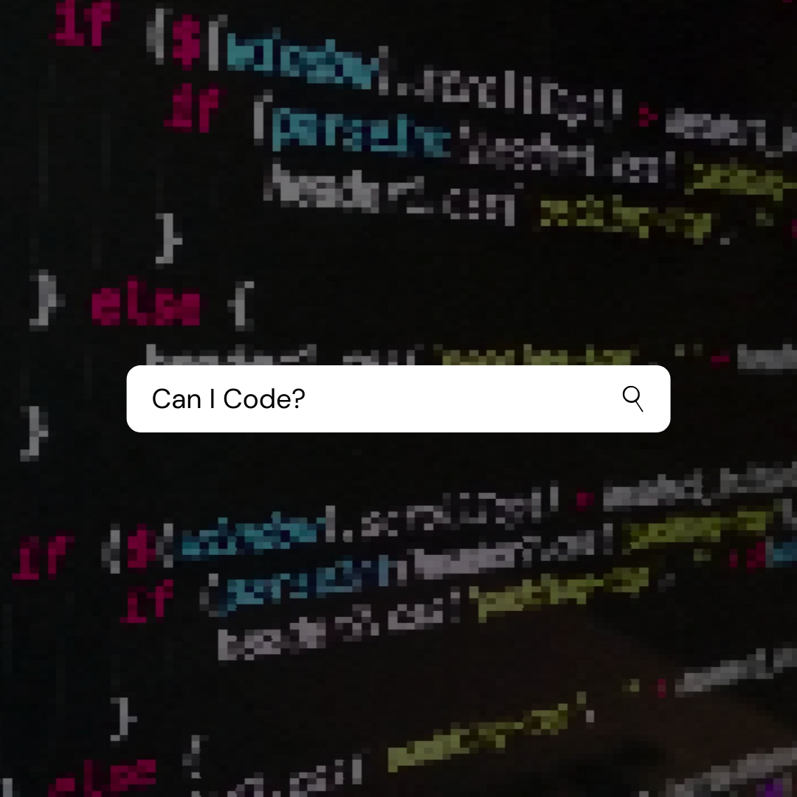

### Hi there 👋

**Thanks for stopping By. I am Ujjwal! (hie)**
 

> I have read so many pretty bios of amazing coders describing their love for Open Source and their experience in bla bla projects. It's all fun
and games, until it comes to writing down my own Bio. I really dun know how to make my Bio Exceptional. I am just a noob person pulled down by life to 
remain rookie. I am trying to get through circumstances of life and improve myself. Projects, Competetive Coding and Shit. Stay tuned. 

Do I know Coding though?
Good Question. 
  A bit.  
  > **My knowledge tags**
  
  
  
  
  
  
  
  
> **What do I want to do?**

> I want to go out of my f*ckin comfort zone and make some worthwhile projects which I am working on. 

